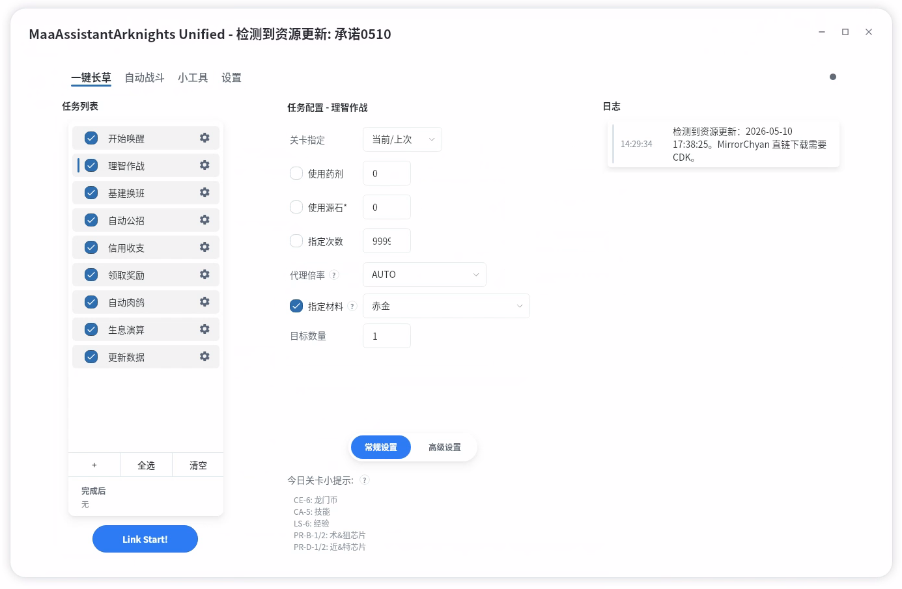
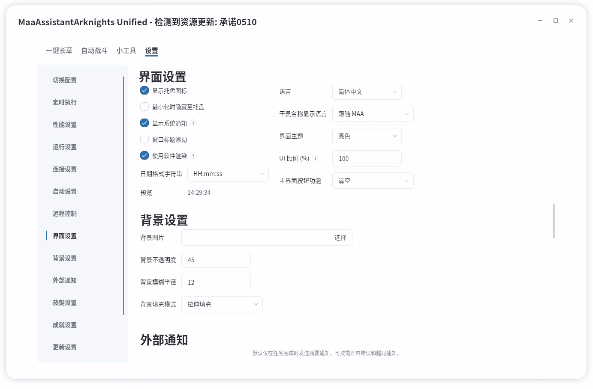

# MAAUnified

`MAAUnified` 是 MAA 的跨平台图形前端，基于 Avalonia 与 .NET 构建。项目按独立仓库形态组织，并以 `submodule` 方式接入 `MaaAssistantArknights` 主仓，主仓路径为 `src/MAAUnified`。

本项目面向 macOS、Linux 与 Windows 的统一 GUI 演进，以现有 WPF 前端行为为主要参考，逐步收口配置语义、交互逻辑与平台能力。涉及 MaaCore、资源、协议与发布链路的内容，应优先保持与主仓既有约定一致。

## 项目定位

- 作为 `MaaAssistantArknights` 的跨平台 GUI 子项目维护。
- 以 Avalonia 实现主窗口、任务配置、平台能力封装与多语言资源。
- 通过 `CoreBridge` 调用 MaaCore，不在前端层重新定义核心协议。
- 在主仓构建链路中参与完整构建、发布与回归验证。

## 界面预览

## 从现有 Windows 版迁移配置

优先推荐在 `MAAUnified` 设置页使用“导入配置”按钮迁移旧版 Windows GUI 配置。

完整导入旧配置时，需要选择这两个文件：

- `config/gui.new.json`
- `config/gui.json`

也可以把这两个文件复制到 `MAAUnified` 运行目录的 `config/` 下；首次启动且尚未生成 `config/avalonia.json` 时，会按 `gui.new.json -> gui.json` 的顺序自动导入。

导入结果可查看 `debug/config-import-report.json`。

## macOS 发布包打开提示

macOS 包优先使用 Developer ID 签名和 Apple notarization。CI 缺少签名材料或签名失败时，会 warning 并降级生成 ad-hoc/unsigned `.dmg`；这类包未公证，首次打开可能需要在“隐私与安全性”中手动允许，或确认来源后执行 `xattr -dr com.apple.quarantine /Applications/MAAUnified.app`。

macOS 运行时目录必须让 `libMaaAdbControlUnit.dylib` 与 `libMaaCore.dylib` 同级。这是 RawByNc 问题的临时处理；本地构建时按 [本地开发](./Docs/zh-cn/develop/development.md) 在 MaaFramework latest release 找对应架构的 macOS 包，并把其中的 `bin/libMaaAdbControlUnit.dylib` 放进 `install/`。

## 开发上手

`MAAUnified` 的完整运行依赖 MaaCore runtime、`resource/` 和主仓打包布局。日常开发建议始终在 `MaaAssistantArknights` 主仓环境里联调，不要只在 `src/MAAUnified` 里单独看托管前端。

### 本地构建、运行与测试

看 [本地开发](./Docs/zh-cn/develop/development.md)；CI、打包和发布看 [CI、发布与验收](./Docs/zh-cn/develop/ci-and-release.md)。

### 代码修改与提交

看 [贡献说明](./Docs/zh-cn/develop/contributing.md)。

## 技术栈

- .NET `10.0`
- Avalonia
- C#
- xUnit

SDK 版本沿用本目录 [`global.json`](./global.json) 中指定的版本。

## 目录结构

- [`App/`](./App/)：应用入口、视图、样式、ViewModel 与 UI 服务。
- [`Application/`](./Application/)：配置、运行时编排、功能服务、诊断与多语言资源。
- [`Platform/`](./Platform/)：托盘、通知、热键、自启动、Overlay 等平台能力封装。
- [`CoreBridge/`](./CoreBridge/)：MaaCore 桥接层与调试替身。
- [`Compat/`](./Compat/)：兼容映射、历史字段与默认值适配。
- [`Tests/`](./Tests/)：单元测试、契约测试与回归测试。
- [`Docs/`](./Docs/)：项目文档索引、迁移说明、开发规范与基线材料。
- [`CI/`](./CI/)：CI 模板与发布辅助脚本。

## 文档入口

- [`Docs/README.md`](./Docs/README.md)：文档总索引。
- [`Docs/zh-cn/README.md`](./Docs/zh-cn/README.md)：中文文档入口。
- [`Docs/zh-cn/develop/development.md`](./Docs/zh-cn/develop/development.md)：本地环境、构建、运行、测试与诊断说明。
- [`Docs/zh-cn/develop/contributing.md`](./Docs/zh-cn/develop/contributing.md)：fork、分支、push、PR 与 submodule 协作流程。
- [`Docs/zh-cn/develop/ci-and-release.md`](./Docs/zh-cn/develop/ci-and-release.md)：CI、打包矩阵、调试包与发布链路说明。
- [`Docs/zh-cn/platform-capabilities.md`](./Docs/zh-cn/platform-capabilities.md)：平台能力与降级说明。
- [`Docs/zh-cn/develop/README.md`](./Docs/zh-cn/develop/README.md)：开发文档索引。
- [`Docs/zh-cn/protocol/README.md`](./Docs/zh-cn/protocol/README.md)：协议与数据约定索引。
